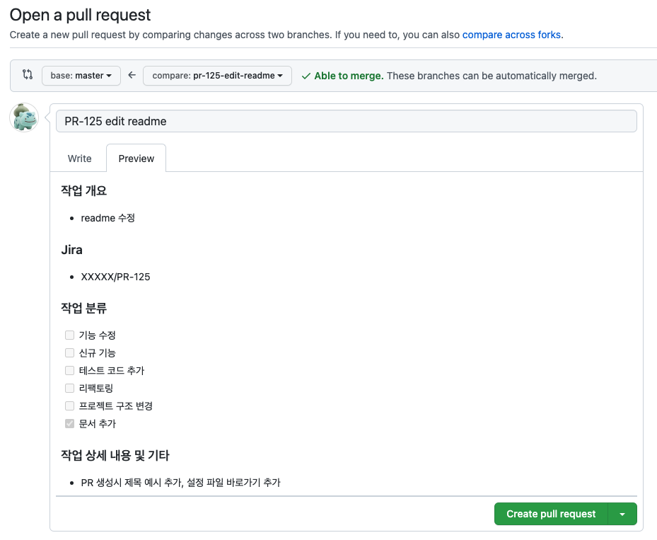

base branch

111 commit
222 commit

# test
pull request template 적용 확인을 위한 test repo

## github pull request template 추가 방법
> 참고: https://docs.github.com/en/communities/using-templates-to-encourage-useful-issues-and-pull-requests/creating-a-pull-request-template-for-your-repository
- repository 내의 hidden directory에 PR template을 추가
- ``` 
  mkdir .github 
  vi .github/pull_request_template.md
  ```
- 생성한 md 파일에 template 내용 작성
- [template 파일 바로가기](https://github.com/sujoungyoon/pr-template-test/blob/master/.github/pull_request_template.md)
- PR 생성시 template 적용 예시
  - 

## PRLint
> 참고: https://github.com/apps/prlint-reloaded
- branch 네이밍 룰
  - Jira ticket 이름의 소문자를 접두어로 함
  - `접두어-간단한 타이틀`형식으로 작성
  - ex) Jira티켓이 DISCO-2309 인 경우 -> `disco-2309-blahblah`
- PR 제목 생성 룰
  - `티켓번호 내용`
  - ex) Jira티켓이 DISCO-2309 인 경우 -> `DISCO-2309 제목내용`
- PRLint
  - rule: [`.github/prlint.json` 규칙 파일 바로가기](https://github.com/sujoungyoon/pr-template-test/blob/master/.github/prlint.json)

  